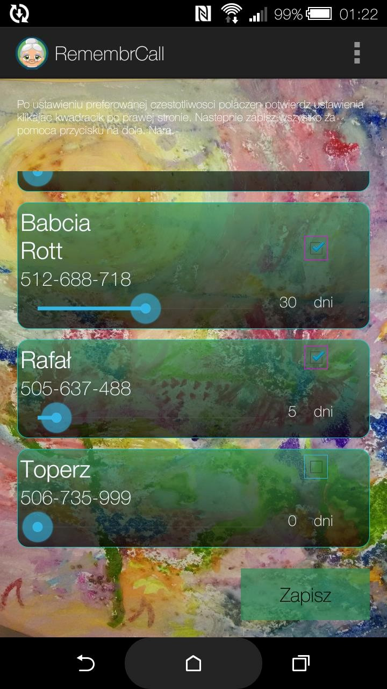
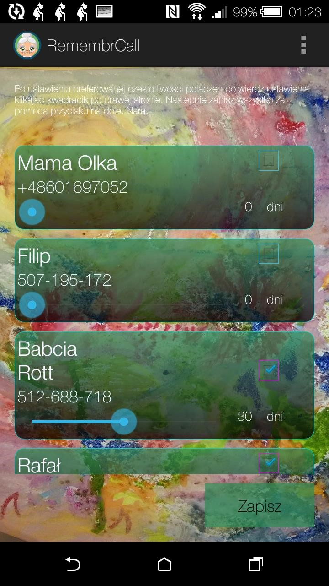
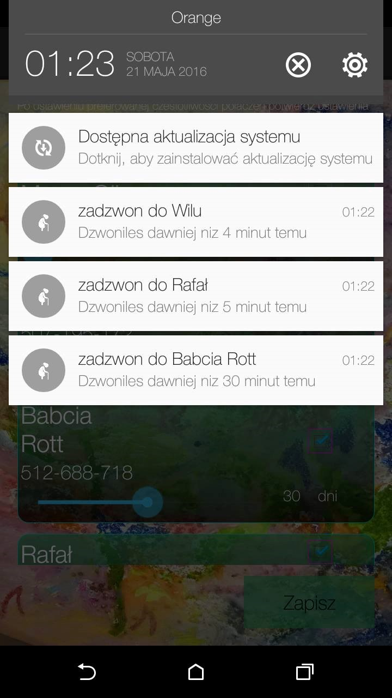
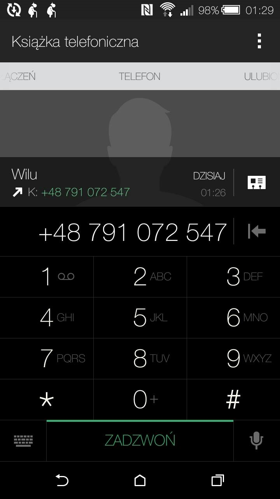

Tkacz Jessica | Tomasz Wilk 
 --------------- | ----------------
 jessica.tkacz@wp.pl | Wilczyy@gmail.com

<p align="center">UNIWERSYTET GDAŃSKI</p>

<p align="center">WYDZIAŁ MATEMATYKI, FIZYKI I INFORMATYKI</p>

**<p align="center">Jessica Tkacz</p>**

**<p align="center">Tomasz Wilk</p>**

<p align="center"><b>Kierunek</b>: Informatyka</p>

<p align="center"><b>Specjalność</b>: Aplikacje internetowe i bazy danych</p>

<p align="center">Aplikacja dla systemu Android usprawniająca kontakty z bliskimi.</p>

<p align="center">Praca licencjacka napisana</p>

<p align="center">pod kierunkiem dr Włodzimierza Bzyla</p>

<p align="center">Gdańsk 2016</p>

SŁOWA KLUCZOWE:
„aplikacja” „Android” ”rodzina” „przypomnienia” „prostota” „adnotacje” „notyfikacje” „kontakt” „organizacja” „oszczędność czasu” „zadzwonić”  „telefon” „systematyczność” „regularny” „połączenie”

##### Spis treści  
<br/>[Streszczenie](#Streszczenie)
<br/>[Wstep](#Wstep)  
<br/>1. Opis problemu
<br/>  1.1 [Porównanie dostępnych rozwiązań](#Porownanie)
<br/>  1.2 [Możliwości zastosowania praktycznego](#Mozliwosci)
<br/>2. Projekt i analiza
<br/>  2.1 Aktorzy i Przypadki użycia
<br/>  2.2 [Wymagania funkcjonalne i niefunkcjonalne](#Wymagania)
<br/>  2.3 Diagram klas
<br/>  2.4 Diagram modelu danych
<br/>  2.5 Projekt interfejsu użytkownika
<br/>  2.6 Funkcjonalności - fragmenty kodu aplikacji
<br/>3. Implementacja
<br/>  3.1 Architektura rozwiązania
<br/>  3.2 Użyte technologie
<br/>  3.3 [Testowanie aplikacji](#Testowanie)
<br/>4. [Wkład własny](#Wklad)
<br/>
<br/>5. [Bibliografia](#Bibliografia)
<br/>
<br/>[Opis problemu](#Opis)


<a name="Streszczenie"/>
## Streszczenie
<p>Jako pracę licencjacką stworzyliśmy aplikację dla systemu Android o nazwie RemembrCall, której zadaniem jest przypominać użytkownikowi o wykonaniu telefonu do wybranego kontaktu. Naszym podstawowym celem jest wspomóc zapominalską lub zapracowaną osobę w relacjach z rodziną. Pomysł powstał na podstawie własnych doświadczeń oraz w wyniku braku satysfakcjonującego nas rozwiązania na rynku.

Nazwa aplikacji dość bezpośrednio wskazuje na jej funkcjonalność, lecz kryje się w niej również nawiązanie do dobrze większości ludzi znanej sagi o Harrym Potterze. Kolega Harry,ego, Neville, był bardzo zapominalskim chłopcem, dlatego babcia przysłała mu Przypominajkę (ang. Remembrall), która zmieniała kolor za każdym razem, kiedy Neville o czymś zapomniał. Nasza aplikacja RemembrCall jest więc kombinacją angielskiej nazwy Przypominajki oraz Call (dzwonić), co niebanalnie wskazuje sposób na jej zastosowanie.

Ze względu na fakt, iż na rynku smartfonów królują w większości te zasilane systemem Android, co bezpośrednio przekłada się na liczbę odbiorców, zdecydowaliśmy się stworzyć naszą aplikację właśnie dla tego systemu.  Dokonaliśmy tego z wykorzystaniem środowiska Android Studio, posługując się językiem programowania Java. Wersja załączona do pracy operuje na systemie minutowym i w takiej postaci była również testowana, natomiast w oficjalnej wersji zamiast minut wprowadziliśmy dni.

W czasach, gdzie praktycznie każdy ma do dyspozycji smartfona bardzo zależało nam, by nasza aplikacja była prosta w obsłudze, żeby mogły z niej korzystać osoby w różnym wieku. Z tego powodu stworzony interfejs jest przejrzysty i nieskomplikowany, tak by nie nastręczał problemów osobie mało obeznanej z coraz to nowszymi technologiami. Naszym zamysłem było, by od strony użytkownika aplikacja była mało wymagająca, dlatego właściwie jedyną czynnością, jaką musi on wykonać to wybrać częstotliwość połączeń z wybranym kontaktem. Doszliśmy również do wniosku, że nie chcemy tworzyć kolejnej aplikacji z niepotrzebnymi funkcjami i częstymi aktualizacjami, które wzbudzają jedynie irytację, gdyż takich jest na rynku do wyboru aż nadmiar. Nasza RemembrCall spełnia swe zadanie i działa tak jak powinna, a przy tym nie wymaga wiele czasu ani specjalnych umiejętności.
</p>

<a name="Wstep"/>
## Wstep
<p>Wartości rodzinne i ogólnie międzyludzkie są jednymi z najważniejszych dla każdego człowieka. W obecnych czasach mamy bardzo rozwiniętą sieć komunikacji, nie musimy pisać listów i czekać tygodniami na odpowiedź. Wystarczy sięgnąć po telefon bądź komunikator internetowy i możemy porozmawiać nawet twarzą w twarz z osoba będącą w dowolnym miejscu na świecie. Paradoksalnie urządzenia, które miały pomóc w tym kontakcie coraz częściej oferują inne zastosowania, pochłaniające czas i kierujące myśli na inne tory, także często okazuje się, że zapominamy o tym, co najważniejsze. Również z większą ilością obowiązków, pracą, zatracamy lub tłumimy tę potrzebę kontaktu z najbliższymi. Bardzo wielu młodych ludzi zapomina jak ważne są rozmowy czy spotkania dla starszego pokolenia. Tymczasem wystarczy raz na tydzień czy dwa zadzwonić do babci, by była szczęśliwa. Dzięki temu i ta młoda osoba, która być może na razie nie widzi takiej potrzeby, na przyszłość nie będzie żałowała zaniedbywania tej sfery życia. Inaczej w efekcie nadchodzi moment, kiedy człowieka nachodzi refleksja, że chciałby to zmienić,a czasem bywa za późno. Stworzona przez nas aplikacja RemembrCall ma na celu wspomóc pielęgnowanie więzi poprzez choćby cotygodniową rozmowę.	
</p>	
<a name="Porownanie"/>
## Porównanie dostępnych rozwiązań
Analiza dostępnych rozwiązań rozpoczęła się na długo przed podjęciem decyzji o pisaniu naszej aplikacji, jako że szukaliśmy czegoś podobnego do własnego użytku. Istnieją oczywiście aplikacje dla systemu Android, które choć po części miały spełniać podobną rolę, ale posiadały one zazwyczaj zbyt wiele skomplikowanych ustawień oraz niepotrzebnych funkcji, do których po krótkim czasie traciło się cierpliwość. Celem naszego rozwiązania jest prostota oraz brak konieczności częstego powracania do ustawień, co z kolei prowadzi do kolejnych atutów – oszczędności czasu oraz użyteczność osobom starszym, niezaznajomionym dobrze z nowymi technologiami. Ponadto aplikacja wszystkim swoim użytkownikom wysyła adnotacje z przypomnieniem o np. Dniu Dziadka albo Dniu Matki, co jest ponadprogramową okazją do wykonania telefonu.
	

<a name="Mozliwosci"/>
## Możliwości zastosowania praktycznego
Aplikacja ma na celu wspomóc osoby, które z różnych powodów nie pamiętają o wykonaniu telefonu do bliskich osób, choć ważne jest dla nich utrzymywanie dobrych stosunków z nimi oraz regularny kontakt. Naszym celem było by prosty w obsłudze interfejs oraz jednorazowa konieczność tworzenia ustawień sprawiły by aplikacja mogła cieszyć się popularnością wśród różnych grup wiekowych. Nasze rozwiązanie może posłużyć zarówno młodzieży, która przez nawał obowiązków nie zawsze pamięta o tym, żeby zadzwonić do ukochanej babci, jak i również osobom starszym w kontaktach z rodziną czy w przypadku regularnych wizyt u lekarza wymagających rejestracji. Ponadto aplikacja może zostać wykorzystana przez  specjalistów różnych dziedzin jako wsparcie w kontakcie z klientami w regularnych odstępach czasu (np. comiesięczne przypomnienie o wizycie ortodontycznej). 
2. Projekt i analiza

W tym rozdziale pragniemy przedstawić wybrane diagramy związane ze sposobem działania naszej aplikacji, jej strukturą oraz samym jej zaprojektowaniem.
    


<a name="Wymagania"/>
## 2.2. Wymagania funkcjonalne i niefunkcjonalne

Wymagania funkcjonalne:
Aplikacja pobiera pełną listę kontaktów z telefonu użytkownika i wyświetla ją wraz z opcjami ustawień. Właściciel ustawia pożądaną częstotliwość przypomnień o połączeniu z danym kontaktem za pomocą seekBar, a obok prezentują się rezultaty wykonanych czynności w postaci ilości dni. Następnie wstępnie zapisuje te ustawienia za pomocą checkBox, ponieważ tylko zaznaczone w ten sposób kontakty zostaną uwzględnione przez aplikację. Jest to zabezpieczenie na wypadek, gdyby użytkownik przypadkiem ustalił priorytet w kontakcie, na temat którego powiadomień nie chce otrzymywać. Na sam koniec wystarczy potwierdzić wszystkie ustawienia za pomocą guzika na dole, co da aplikacji ostateczną wersję, którą ma wziąć pod uwagę. W każdym momencie użytkownik może powrócić do owych ustawień i je zmienić.


Wymagania niefunkcjonalne:
Oczywistym ograniczeniem jest fakt, iż aplikacja jest zorientowana na system Android i na żadnym innym nie będzie działała. Możliwe jest używanie jej zarówno na smartfonach, jak i tabletach posiadających wersję systemu Android 5.0. i wzwyż.
Można również uruchomić aplikację w środowisku Android Studio, w którym była pisana i oglądać efekty próbnych działań na wybranym emulatorze posiadającym odpowiednią wersję systemu. 
 

2.6 Funkcjonalności - fragmenty kodu aplikacji

a) Funkcja setContactCalls odpowiedzialna jest za dopasowanie połączeń do konkretnych kontaktów:
```java
    public void setContactCalls(Map<String, Contact> contactsMap, Map<String, ArrayList<Call>> callsMap){

        final String[] numberProjection = new String[]{
                Phone.NUMBER,
                Phone.CONTACT_ID,
        };

        Cursor phone = new CursorLoader(context,
                Phone.CONTENT_URI,
                numberProjection,
                null,
                null,
                null).loadInBackground();

        if (phone.moveToFirst()) {
            final int contactNumberColumnIndex = phone.getColumnIndex(Phone.NUMBER);
            final int contactIdColumnIndex = phone.getColumnIndex(Phone.CONTACT_ID);

            while (!phone.isAfterLast()) {
                final String numberBeforeConversion = phone.getString(contactNumberColumnIndex);
                final String contactId = phone.getString(contactIdColumnIndex);
                String number = numberBeforeConversion.replaceAll("\\D+","");

                Contact contact = contactsMap.get(contactId);
                ArrayList<Call> calls = callsMap.get(number);

                Call recentCall = new Call();
                if(calls != null) {
                    for (Call c : calls){
                        if(Integer.parseInt(c.getDuration()) > 0){
                            if(c.getDate().compareTo(recentCall.getDate())>0){
                                recentCall = c;
                            }
                        }
                    }
                }

                if (contact == null) {
                    continue;
                }

                contact.setRecentCall(recentCall);

                Log.i("TUTAJ numer+data", number +" --> "+ contact.recentCall.getDate());
                phone.moveToNext();
            }
        }

phone.close();
```

b) Funkcja CallNotification odpowiedzialna za pokazanie pojedynczej notyfikacji:
```java
 public class CallNotification {

    static int notificationNumber = 0;
    public CallNotification(){
    }

    public void showNotification(String message, String tittle, Context context, int id, String phoneNumber) {
        Intent intent = new Intent(Intent.ACTION_DIAL);
        intent.setData(Uri.parse("tel:"+phoneNumber));

        PendingIntent pi = PendingIntent.getActivity(context, 0, intent, 0);

        Notification notification = new NotificationCompat.Builder(context)
                .setSmallIcon(R.drawable.babcia)
                .setContentTitle(tittle)
                .setContentText(message)
                .setContentIntent(pi)
                .setAutoCancel(true)
                .build();

        NotificationManager notificationManager = (NotificationManager) context.getSystemService(context.NOTIFICATION_SERVICE);
        notificationManager.notify(id, notification);
        notificationNumber++;
    }

}
```

c) Głowa programu odpowiedzialna za wybieranie kontaktów nadających się do wysłania notyfikacji:
```java
                if(c.isChecked()){
                    Log.i("longCall", c.name + " " + c.delay + " od ostatniej rozmowy "+ (c.getProgression()*(1000)));
                    String tittle = "zadzwon do " + c.getName();
                    String message = "Dzwoniles dawniej niz "+ c.getProgression() + " minut temu";
                    String number = "" ;
                    if (c.numbers.size() > 0 && c.numbers.get(0) != null) {
                        number = c.numbers.get(0).number;
                    }

                    if(c.getDelay() > c.getProgression()*(1000*60)){
                        Log.i("longCall", message);
                        new AlarmBroadcaster(context,tittle , message, number, c.id).setAlarmBroadcast(0);
                    } else {
                        Log.i("longCall", "dzwoniles do " + c.name + " zadzwon za " + (c.getProgression()-(c.getDelay()/(1000*60))));
                        new AlarmBroadcaster(context, tittle, message,number, c.id)
                                .setAlarmBroadcast((int) (c.getProgression()-(c.getDelay()/(1000*60))));
                    }

                } else {
                    new AlarmBroadcaster(context).cancelAlarm(c.id);

                }
```

d) Klasa odpowiedzialna za tworzenie alarmów systemowych, które po danym czasie wywołają funkcje wyświetlającą notyfikacje. + możliwość anulowania zakolejkowanych notyfikacji:
```java
    public class AlarmBroadcaster {
        private Context context;
        private PendingIntent reminderBroadcastIntent;

        public  AlarmBroadcaster(Context context){
            this.context = context;
        }
        public AlarmBroadcaster(Context context, String tittle, String message, String phoneNumber, String id) {
            this.context = context;
            Intent intent = new Intent(context, AlarmReceiver.class);
            intent.putExtra("tittle", tittle);
            intent.putExtra("message", message);
            intent.putExtra("id", id);
            intent.putExtra("phoneNumber", phoneNumber);
            reminderBroadcastIntent = PendingIntent.getBroadcast(context, Integer.parseInt(id), intent, PendingIntent.FLAG_UPDATE_CURRENT);

        }

        public void setAlarmBroadcast(int minutes){
            //Set the alarm to 10 seconds from now
            Calendar c = Calendar.getInstance();
            c.add(Calendar.MINUTE,  minutes);
            long when = c.getTimeInMillis();
            // Schedule the alarm!
            AlarmManager alarmToBroadcast = (AlarmManager)context.getSystemService(Context.ALARM_SERVICE);
            alarmToBroadcast.set(AlarmManager.RTC_WAKEUP, when, reminderBroadcastIntent);
        }
        public void cancelAlarm(String id){
            AlarmManager alarmToCancel = (AlarmManager)context.getSystemService(Context.ALARM_SERVICE);
            Intent intent = new Intent(context, AlarmReceiver.class);
            PendingIntent pendingIntentToCancel = PendingIntent.getBroadcast(context, Integer.parseInt(id), intent, PendingIntent.FLAG_UPDATE_CURRENT);
            alarmToCancel.cancel(pendingIntentToCancel);
        }
    }
}
```

e) ViewDisplay jest adapterem, który zajmuje się wyświetlaniem zapisanych ustawień użytkownika, lub (jeżeli nie ma zapisanych) wyświetla domyślne ustawienia.
```java
 public class ViewDisplay extends ArrayAdapter<Contact>{


	public ViewDisplay(Context context, ArrayList<Contact> contacts) {
		super(context, 0, contacts);
	}

	@Override
	public View getView(int position, View convertView, ViewGroup parent) {
		// Get the data item
		Contact contact = getItem(position);
		// Check if an existing view is being reused, otherwise inflate the view
		View view = convertView;
		if (view == null) {
			LayoutInflater inflater = LayoutInflater.from(getContext());
			view = inflater.inflate(R.layout.single_contact, parent, false);
		}
		// Populate the data into the template view using the data object
		TextView name = (TextView) view.findViewById(R.id.tvName);
		TextView phone = (TextView) view.findViewById(R.id.tvPhone);
		SeekBar contactSeekBar = (SeekBar) view.findViewById(R.id.contactSeekBar);
		TextView seekBarProgress = (TextView) view.findViewById(R.id.seekBarProgress);
		CheckBox checkBox = (CheckBox) view.findViewById(R.id.remindCheckBox);

		contact.setSeekBar(contactSeekBar);
		contact.setProgressValue(seekBarProgress);
		contact.setCheckBox(checkBox);
		contact.initializeContact();
		contactSeekBar.setProgress(contact.getProgression());
		seekBarProgress.setText(""+contact.getProgression());
		checkBox.setChecked(contact.isChecked());


		name.setText(contact.name);
		phone.setText("");

		if (contact.numbers.size() > 0 && contact.numbers.get(0) != null) {
			phone.setText(contact.numbers.get(0).number);
		}

		return view;
	}
}
```

g) Funkcja tworząca mapę połączeń przypisanych do numeru na podstawie historii połączeń telefonu.
```java
 public void getCallDetails(Context context) {
        Log.i("LogDetails12", "getCallDetails");

        final String[] numberProjection = new String[]{
                CallLog.Calls.NUMBER,
                CallLog.Calls.DATE,
                CallLog.Calls.DURATION,
                CallLog.Calls.CACHED_NAME,
        };

        Cursor callDetailsCursor = new CursorLoader(context,
                CallLog.Calls.CONTENT_URI,
                numberProjection,
                null,
                null,
                null).loadInBackground();

        int number = callDetailsCursor.getColumnIndex(CallLog.Calls.NUMBER);
        int date = callDetailsCursor.getColumnIndex(CallLog.Calls.DATE);
        int duration = callDetailsCursor.getColumnIndex(CallLog.Calls.DURATION);
        int name = callDetailsCursor.getColumnIndex(CallLog.Calls.CACHED_NAME);


        while (callDetailsCursor.moveToNext()) {
            String phNumber = callDetailsCursor.getString(number);
            String callDate = callDetailsCursor.getString(date);
            String contactName = callDetailsCursor.getString(name);
            Date callDateTime = new Date(Long.valueOf(callDate));
            String callDuration = callDetailsCursor.getString(duration);


            if(callsMap.get(phNumber) != null)
            {
                ArrayList<Call> calls = callsMap.get(phNumber);
                calls.add(new Call(callDateTime, callDuration, contactName));
                callsMap.put(phNumber, calls);

            } else {
                ArrayList<Call> calls = new ArrayList<>();
                calls.add(new Call(callDateTime, callDuration, contactName));
                callsMap.put(phNumber, calls);
            }

        }
callDetailsCursor.close();
```

3.2 Użyte technologie

Aplikacja została napisana w języku programowania Java w środowisku Android Studio w wersji 2.1.. Aplikacja zaprogramowana została z myślą o użytkownikach systemu Android 5.0. bądź późniejszym. Program kompilowany był dla wersji Android API 21., a buildowany dokładnie dla wersji 21.1.2. poprzez gradle 2.1. Odbiór zewnętrznych wiadomości został zrealizowany przez GCM (ang. Google Cloud Messages) przy pomocy pushbots w wersji 2.0.13.. Front-end występuje w postaci plików xml (ang. Extensible Markup Language) w wersji 1.0. z kodowaniem UTF-8.
Projekt interfejsu użytkownika.

Strona główna po uruchomieniu aplikacji RemembrCall. Wyświetlają się tutaj wszystkie kontakty pobrane z telefonu. Do każdego kontaktu widzianego
w osobnej ramce mamy opcje wyboru częstotliwości połączeń oraz pole do zaznaczenia aby ustawienia zostały wzięte pod uwagę. Na dole po prawej stronie widnieje przycisk „Zapisz”, którego wciśnięcie jest konieczne do działania aplikacji. Na samej górze znajduje się krótki opis korzystania z niej.

======
Przykładowy widok notyfikacji przypominających o wykonaniu telefonu do konkretnej osoby, wysłanych po wybranym przez użytkownika czasie. Adnotacja przybiera kształt spacerującej o lasce staruszki, co nawiązuje tematycznie do ikony całej aplikacji.

======
Po rozwinięciu czarnego paska u góry pokazują się szczegóły poszczególnych notyfikacji takie jak nazwa kontaktu oraz ilość dni, które minęły od ostatniego połączenia z nim.

======
Po kliknięciu konkretnej adnotacji aplikacja przekierowuje użytkownika bezpośrednio do Książki telefonicznej z już wybranym numerem kontaktu, odnośnie którego notyfikację wybraliśmy. Jest to o tyle komfortowe, że dopóki nie klikniemy adnotacji, będzie nam ona wciąż przypominała o tym, żeby zadzwonić, a gdy zostanie już wybrana poniekąd zmusi użytkownika do wykonania zaplanowanego telefonu.

======

3. Implementacja

<a name="Testowanie"/>
## 3.3 Testowanie aplikacji
	Testowanie aplikacji przeprowadzono manualnie wykonując wybrane operacje w aplikacji.
	
<a name="Wklad"/>
## Wkład własny

Określenie indywidualnego wkładu w pracę każdego z członków zespołu:
Tkacz Jessica: 
* wczytywanie ustawień dla kontaktów,
* strona wizualna aplikacji (front-end oraz widoki),
* modele kontaktów,
* pobieranie rejestru połączeń, 
* dokumentacja

Wilk Tomasz: 
* zapisaniem ustawień dla kontaktów,
* pobieranie kontaktów z urządzenia, 
* zarządzaniem notyfikacjami, 
* mechanizm opóźniający, 
* zarządzanie broadcasterem, 
* testowanie aplikacji
